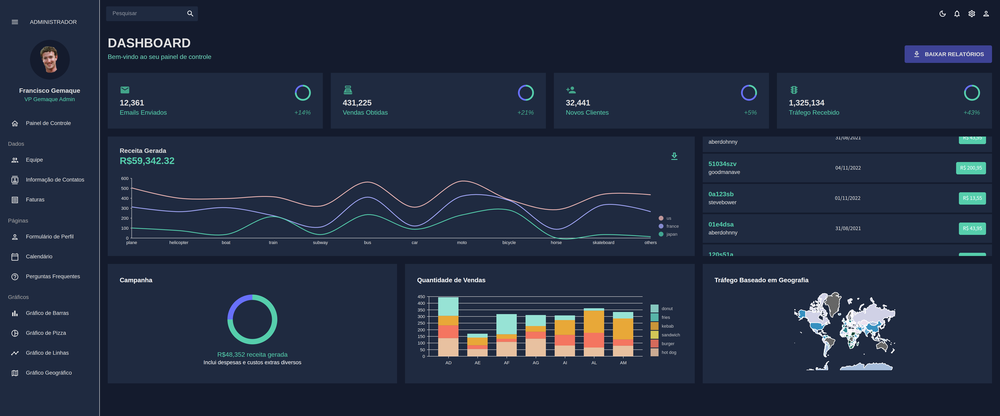

# 📊 Projeto Painel Administrativo

Um painel administrativo moderno, responsivo e totalmente estilizado utilizando React, Material UI (MUI) e múltiplos tipos de gráficos.

Este projeto foi desenvolvido com foco em boas práticas, componentização, organização e escalabilidade.



---

## 🚀 Tecnologias

- ⚡ React 18
- ⚡ Material UI (MUI)
- ⚡ Nivo Charts (Line, Bar, Geography)
- ⚡ FullCalendar
- ⚡ Formik + Yup
- ⚡
- ⚡ React Router DOM v6
- ⚡ Context API (tema claro/escuro)
- ⚡ Icons MUI
- ⚡ Mock Data (JSON)

---

## 🧪 Funcionalidades

- Dashboard
- Gestão de Equipe
- Contatos
- Faturas
- Formulário
- Calendário (FullCalendar)
- Gráficos (Nivo)
- Tema Claro/Escuro

---

## 🛠️ Como executar o projeto

1. Clone o repositório:
```bash
git clone https://git@github.com:gemaquejr/react-gemaque-dashboard.git
```
2. Instalar dependências:
```bash
npm install
```

3. Rodar o servidor de desenvolvimento:
```bash
npm start
```

---

Desenvolvido com ❤️ por [Francisco Gemaque](https://www.linkedin.com/in/gemaquejr/)
